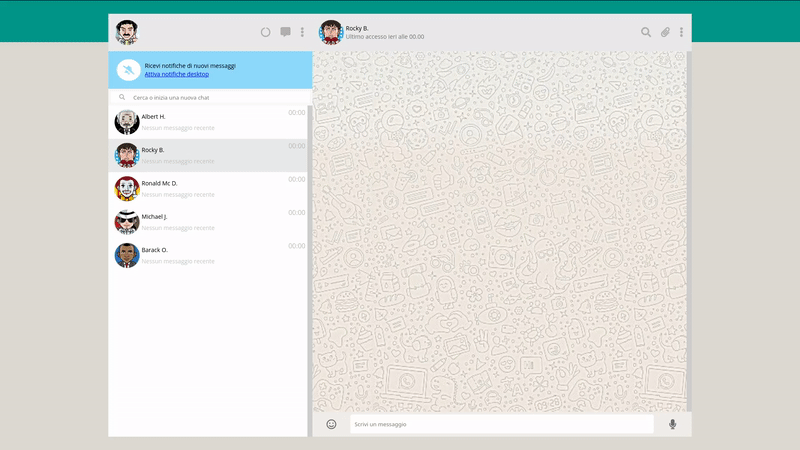

**Replica di Whatsapp Web (HTML - CSS - JS - JQUERY)**

**_Funzioni implementate:_**

- invio di un messaggio
- ricezione risposta in automatico dopo 1 secondo (random da un array)
- scroll automatico della chat all'ultimo messaggio sia inviato che ricevuto
- selezione chat da elenco a sinistra
- cambio dati nell'header della chat in base alla chat selezionata
- aggiornamento ora ultimo accesso su elenco chat
- aggiornamento ultimo messaggio scambiato su elenco chat
- se l'utente seleziona un'altra chat prima di aver ricevuto il messaggio di risposta, questo viene inviato sulla chat corretta e non sulla chat al momento attiva.
- funzione di ricerca della chat dall'elenco
